# Doctor Finder Application

A React-based Doctor Finder application developed as part of the UpGrad Frontend Capstone Project. The application enables users to browse doctors, filter by specialty, view doctor details, book appointments, manage appointments, and submit ratings and reviews.

---

## Project Overview

Doctor Finder is a healthcare appointment booking platform that allows patients to:

- Browse available doctors
- Filter doctors by specialty
- View detailed doctor information
- Register and log in securely
- Book appointments with doctors
- View appointment history
- Rate completed appointments
- View doctor ratings

The application is built using React and Material-UI and communicates with a RESTful backend API.

---

## Features

### Authentication

- User Registration
- User Login
- Session Management
- Form Validation

### Doctor Management

- View all doctors
- Filter doctors by specialty
- View doctor details
- View doctor ratings

### Appointment Management

- Book appointments
- View appointment history
- View appointments only when logged in

### Rating System

- Submit ratings for completed appointments
- Add comments and feedback
- View updated doctor ratings

---

## Technology Stack

### Frontend

- React.js
- JavaScript (ES6+)
- Material UI
- React Router
- Axios

### Development Tools

- Visual Studio Code
- Git
- GitHub
- Node.js
- npm

---

## Project Structure

```text
src
├── assets
├── common
├── screens
│   ├── appointment
│   ├── doctorDetails
│   ├── home
│   └── login
├── util
├── App.js
├── index.js
└── index.css
```

---

## Installation and Setup

### Clone Repository

```bash
git clone https://github.com/aadeie/UpGrad_Capstone_Frontend_Project.git

```

### Navigate to Project Folder

```bash
cd UpGrad_Capstone_Frontend_Project
```

### Install Dependencies

```bash
npm install
```

### Start Application

```bash
npm start
```

Application will run at:

```text
http://localhost:3000
```

---

## Backend Configuration

Ensure the backend service is running before starting the frontend.

Default backend URL:

```text
http://localhost:8080
```

---

# Application Screenshots

## Home Page (Logged Out)

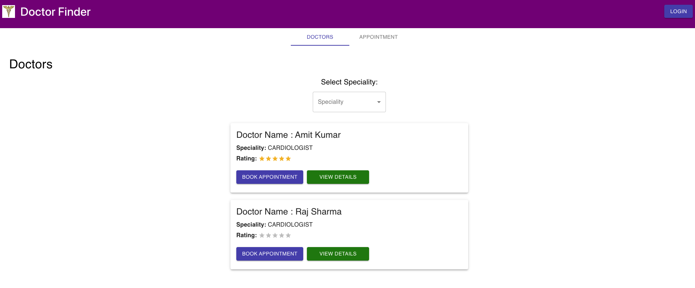

---

## Home Page (Logged In)

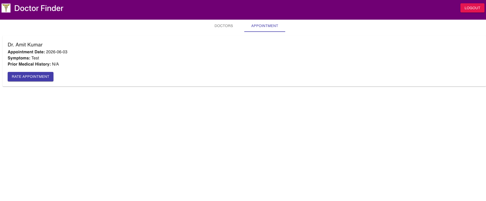

---

## Login Validation

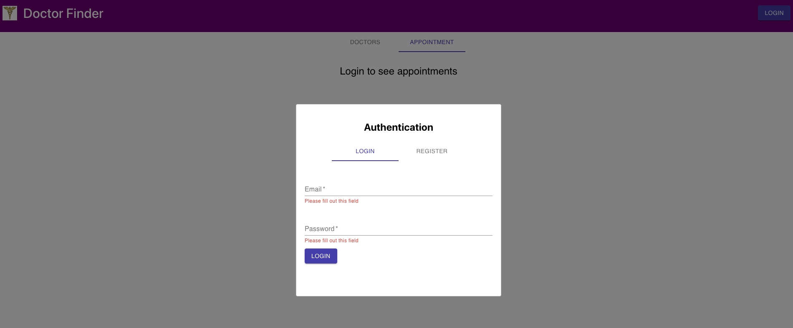

---

## Registration Validation

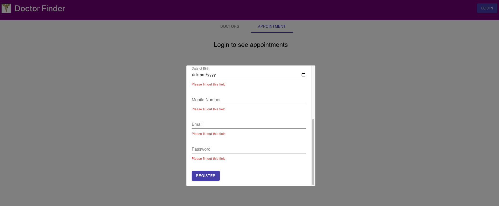

---

## Doctor Listing

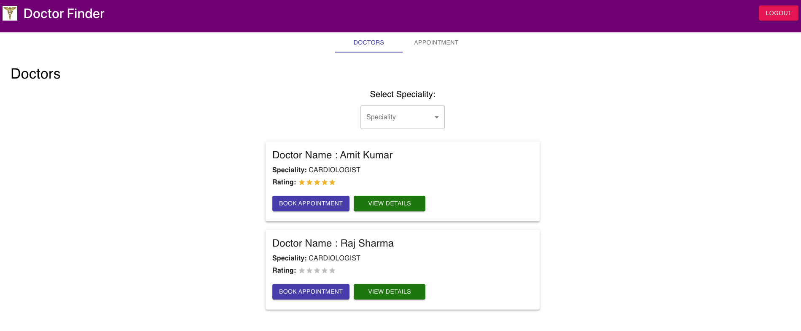

---

## Specialty Filter

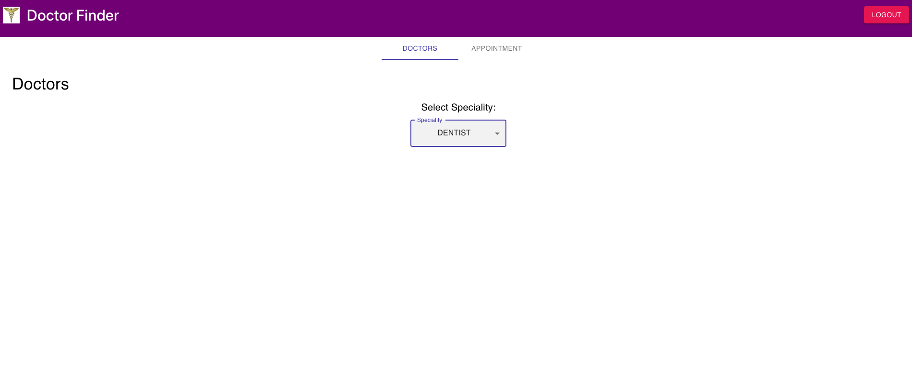

---

## Doctor Details

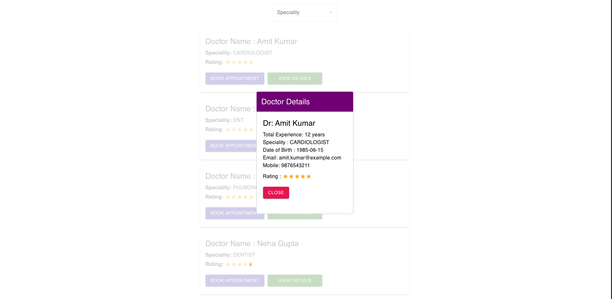

---

## Book Appointment

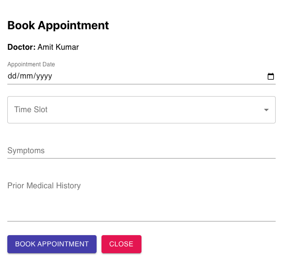

---

## Appointment Tab (Logged Out)

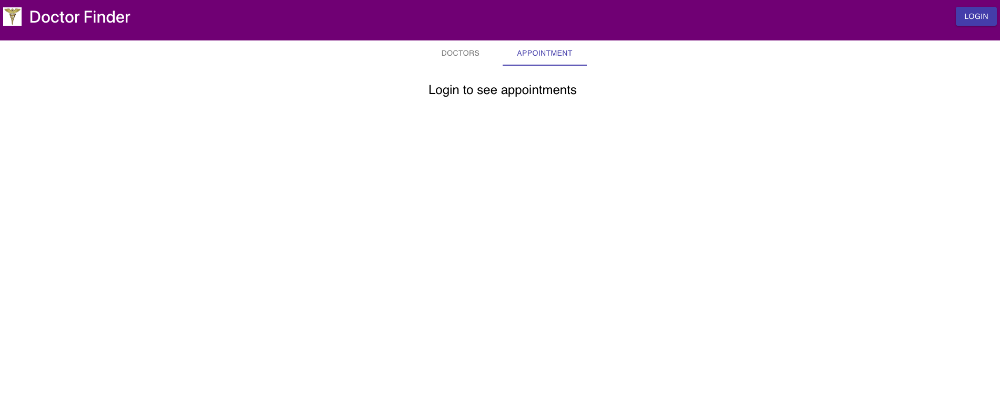

---

## Appointment Tab (Logged In)


---

## Appointment Overview

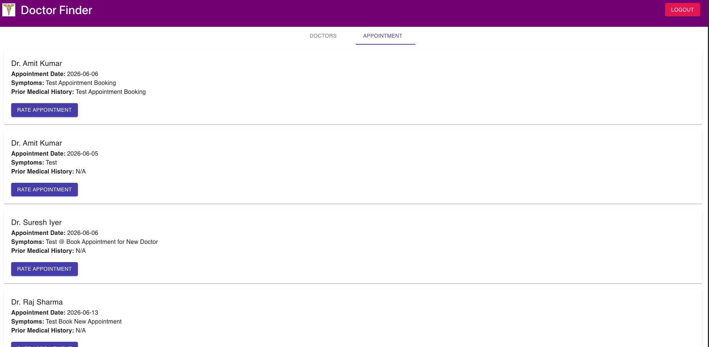

---

## Rate Appointment

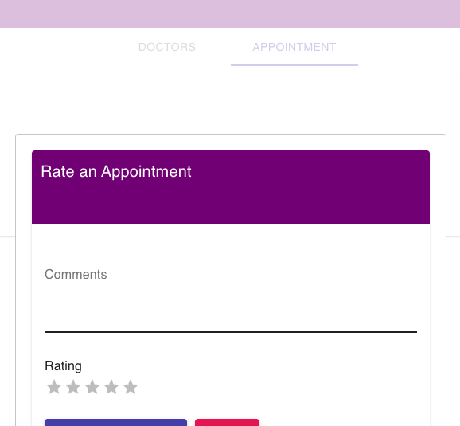

---

## Appointment Rated Successfully

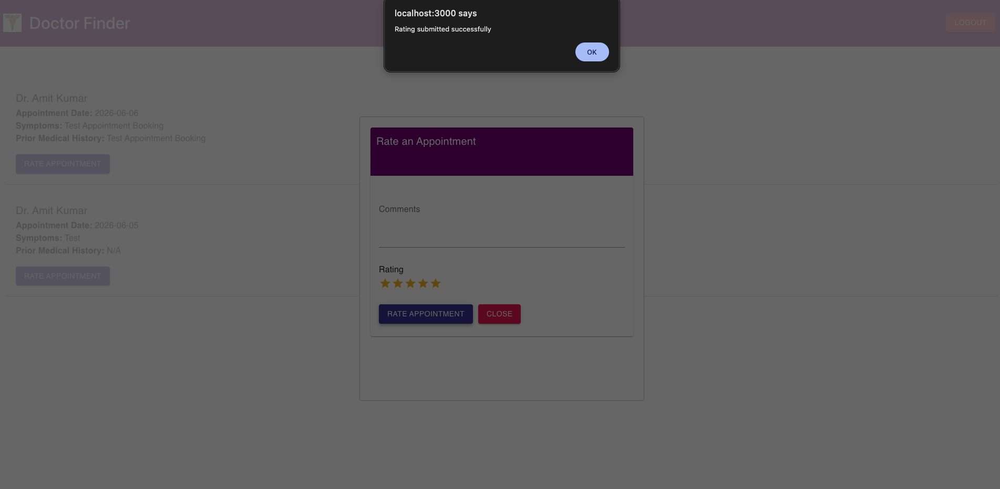

---

## Ratings Overview

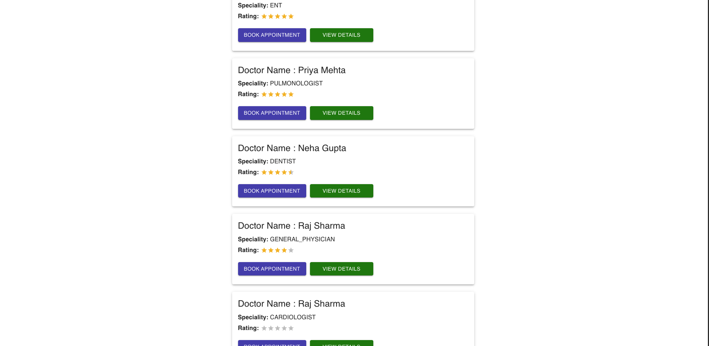

---

## Key Functionalities Implemented

### User Features

- User Registration
- User Login
- Authentication Validation
- Logout Functionality

### Doctor Features

- View Doctors
- Filter by Specialty
- Doctor Details Modal
- Doctor Rating Display

### Appointment Features

- Appointment Booking
- Appointment History
- Protected Appointment View

### Rating Features

- Rate Appointments
- Submit Reviews
- View Updated Ratings

---

## Future Enhancements

- JWT Authentication
- User Profile Management
- Appointment Cancellation
- Doctor Search
- Pagination
- Responsive Mobile Design
- Notifications and Reminders

---

## Learning Outcomes

Through this project I gained hands-on experience with:

- React Components
- State Management
- React Hooks
- React Router
- REST API Integration
- Material UI
- Form Validation
- Frontend Architecture
- Git and GitHub Workflow

---

## Author

**Aditya Sharma**

UpGrad Frontend Capstone Project

GitHub Repository:

https://github.com/aadeie/UpGrad_Capstone_Frontend_Project

---
